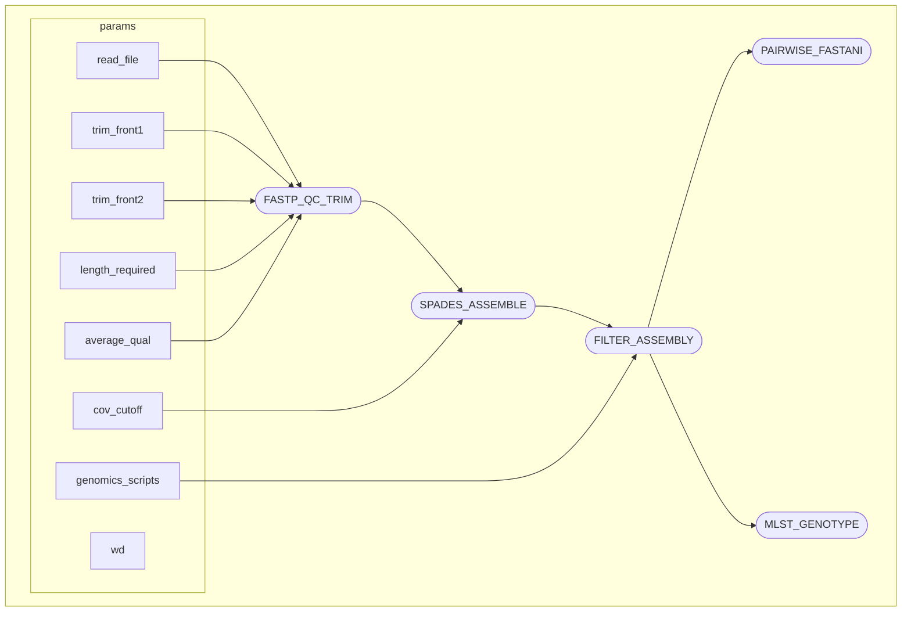

# bacterial_genomes_workflow
Nextflow workflow to quality control, trim, assemble multiple paired-end Illumina samples, compute all their pairwise ANIs and genotyping them.

## Installation
Install [nextflow](https://www.nextflow.io/docs/latest/install.html). Also Install python=2.7 and biopython (to filter contigs)
```bash
CONDA_SUBDIR=osx-64 conda create -n py27 python=2.7 biopython
```
## Test run
Clone repository into your directory and activate python2.
```bash
git clone && cd bacterial_genomes_workflow
conda activate py27
```
Concatenate test data file with your current directory.
```bash
awk -v prefix="$(pwd)/" '{   
  for (i=1; i<=NF; i++) $i = prefix $i;
  print
}' OFS='\t' test_data/test_data.txt > tmp && mv tmp test_data/test_data.txt
```
Run the workflow on the mini test data. Note that an absolute path has to be specified for `--wd`, which will store all the output files.
```bash
nextflow run assembly.nf --read_file test_data/test_data.txt --wd ~/test_run/
```
```bash
 N E X T F L O W   ~  version 24.10.5

Launching `assembly.nf` [pedantic_pesquet] DSL2 - revision: 4640ac09d8

executor >  local (11)
[43/1fa886] FASTP_QC_TRIM (3)   [100%] 3 of 3 ✔
[2d/85630f] SPADES_ASSEMBLE (1) [100%] 3 of 3 ✔
[be/3c3d87] FILTER_ASSEMBLY (3) [100%] 3 of 3 ✔
[45/46e449] PAIRWISE_FASTANI    [100%] 1 of 1 ✔
[17/1fdb1c] MLST_GENOTYPE       [100%] 1 of 1 ✔

Completed at: 11-Apr-2025 18:16:51
Duration    : 2m 20s
CPU hours   : 0.1
Succeeded   : 11


``` 
## Versions of software used
* nextflow 24.10.5.5935
* python 2.7.15
* fastp 0.24.0
* spades 4.1.0
* fastani 1.33
* mlst 2.23.0
